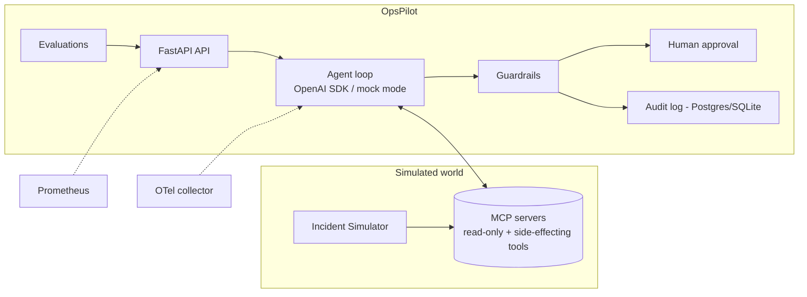

# OpsPilot 🚁

**OpsPilot** is an agentic incident-response platform. It investigates simulated
production incidents using MCP (Model Context Protocol) servers, tool calling,
guardrails, human approval, audit logs, and evaluations.

> **Safety:** OpsPilot only ever talks to *simulated* infrastructure. It never
> touches real production systems and never ships real credentials.

## Status

See [BUILD_STATUS.md](BUILD_STATUS.md) for the current phase, test results,
and remaining work.

## Tech stack

| Concern            | Choice                                                  |
| ------------------ | ------------------------------------------------------- |
| Language           | Python 3.12                                             |
| API                | FastAPI + Uvicorn                                       |
| Schemas/config     | Pydantic v2 + pydantic-settings (env vars only)         |
| Agent protocol     | Official MCP Python SDK                                |
| LLM                | Official OpenAI SDK — **deterministic mock mode default** |
| Storage            | SQLite (local/tests) · PostgreSQL (Docker Compose)      |
| Shared state       | Redis (simulator state)                                 |
| Metrics            | Prometheus (+ `/metrics`)                               |
| Traces             | OpenTelemetry (OTLP → collector)                        |
| Logs               | JSON structured logging (structlog)                     |
| Tests/lint         | pytest (+ pytest-asyncio), ruff                         |
| Orchestration      | Docker Compose, Make                                    |

## Quickstart

```bash
cp .env.example .env      # defaults run in deterministic mock mode (no API key)
make install              # create .venv and install package + dev deps
make test                 # run the test suite
make lint                 # ruff lint + format check
make up                   # build & start api, postgres, redis, prometheus, otel-collector
make inject SCENARIO=bad_deployment   # inject a simulated incident
make investigate           # ask the agent to investigate open incidents
make eval                 # run the evaluation harness
make down                 # stop the stack
make clean                # remove local artifacts + containers/volumes
```

## How it works (target architecture)



**Tool policy**

- **Read-only tools** (metrics, logs, deploys, config) — callable by the agent
  directly, all typed with Pydantic schemas.
- **Side-effecting tools** (rollback, restart, deploy, delete, notify) — always
  gated behind **human approval** before execution, and every attempt is
  recorded in the **audit log**.

**Mock mode:** with `MOCK_LLM=true` (the default), the agent uses a
deterministic scripted responder, so tests and demos need no `OPENAI_API_KEY`.

## Configuration

All configuration comes from environment variables — see
[.env.example](.env.example) for the full list. `.env` is gitignored; never
hardcode API keys.

## Repository layout

```
ops-pilot/
├── Makefile               # install / up / down / test / lint / inject / ...
├── docker-compose.yml     # api, postgres, redis, prometheus, otel-collector
├── docker-compose.override.yml
├── Dockerfile
├── pyproject.toml
├── .env.example
├── prometheus/            # scrape config
├── otelcol/               # OTLP collector config (local debug exporter)
├── src/ops_pilot/
│   ├── config.py          # typed env-driven settings
│   ├── main.py            # FastAPI app (health endpoints for now)
│   └── evals/             # evaluation harness (later phase)
└── tests/                 # pytest suite
```

## License

MIT
