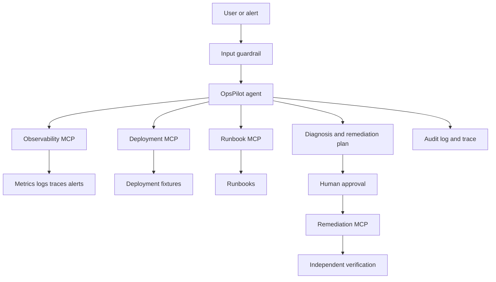

# OpsPilot architecture

OpsPilot is intentionally split into a deterministic local production
laboratory and an agent control plane. The simulator creates known incidents;
MCP servers expose evidence and actions; the agent plans bounded investigations;
guardrails and approvals control side effects.

## Data flow

1. A scenario or alert creates a known fault in the local simulator.
2. The agent discovers MCP tool schemas and selects read-only evidence tools.
3. Tool results are recorded as evidence and included in the diagnosis.
4. Side-effecting tools are blocked until an approval record is approved.
5. Recovery is measured through a separate verification tool.
6. The eval runner replays the same cases and scores the complete trace.

## MCP boundary

The project uses five local MCP servers:

| Server | Access | Responsibility |
| --- | --- | --- |
| Observability | Read-only | Metrics, logs, alerts, traces, baselines |
| Deployments | Read-only | Versions, deployment history, changed files |
| Runbooks | Read-only | Operating procedures and past guidance |
| Remediation | Side effect | Rollback, restart, and recovery verification |
| Incidents | Side effect | Incident records and comments |

The registry is defined in `ops/mcp/servers.json`.
